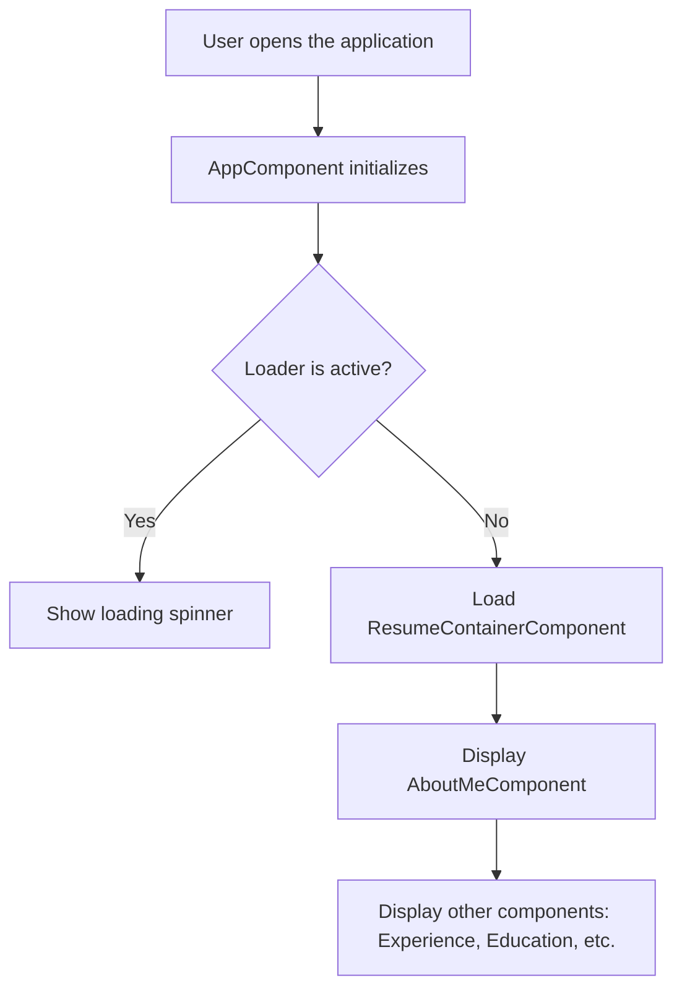
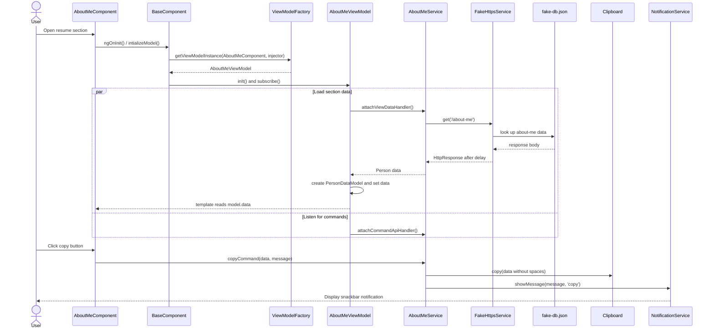

# Documentation Comment

# RaviResume3

## Project Description
This project is a resume builder application developed using Angular. It is designed to showcase personal and professional details in a structured and visually appealing format. The application follows modern web development practices and is built with modularity and scalability in mind.

## Folder Structure
```
Resume3.0/
├── .github/workflows/             # Azure Static Web Apps workflow
├── .vscode/                       # Recommended IDE configuration
├── code-review/                   # Review notes and implementation plan
├── src/
│   ├── app/
│   │   ├── app.component.*        # Root component
│   │   ├── app.module.ts          # Root Angular module
│   │   ├── app-routing.module.ts  # Application routes
│   │   ├── resume/
│   │   │   ├── about-me/                  # Component, view model, and service
│   │   │   ├── awards-and-achievements/   # Component and view model
│   │   │   ├── contact/                   # Contact details component, model, service
│   │   │   ├── contact-me/                # Contact form component and view model
│   │   │   ├── education/                 # Component, view model, and service
│   │   │   ├── experience/                # Component, view model, and service
│   │   │   ├── experience-graph/          # Experience visualization component
│   │   │   ├── hobbies/                   # Component, view model, and service
│   │   │   ├── introduction/              # Component, view model, and service
│   │   │   ├── professional-skills/       # Component, view model, and service
│   │   │   ├── projects-experience/       # Component, view model, and service
│   │   │   ├── resume-container/          # Composes all resume sections
│   │   │   ├── social-media/              # Component and view model
│   │   │   ├── resume-routing.module.ts
│   │   │   └── resume.module.ts
│   │   └── shared-module/
│   │       ├── commands/                  # Copy and download commands
│   │       ├── components/                # Base, progress bar, and dialog components
│   │       ├── constants/                 # API endpoint constants
│   │       ├── enums/                     # Application contexts and command types
│   │       ├── factories/                 # View-model, HTTP, and error factories
│   │       ├── fake-db/                   # Local JSON data source
│   │       ├── functions/                 # Shared helper functions
│   │       ├── interfaces/                # Application contracts
│   │       ├── models/                    # Reusable data and view-model classes
│   │       ├── services/                  # HTTP, loader, notification, and base services
│   │       └── shared.module.ts
│   ├── assets/                    # Images, icons, and resume PDFs
│   ├── environments/              # Development and production settings
│   ├── custom-theme.scss
│   ├── main.ts
│   └── styles.css
├── angular.json                    # Angular CLI configuration
├── karma.conf.js                   # Karma test runner configuration
├── LICENSE                         # GNU GPL v3.0
├── package.json                    # Scripts and dependencies
├── SECURITY.md                     # Security policy
├── tsconfig*.json                  # TypeScript configurations
└── README.md
```

### Key Folders
- **app/**: Contains the main application logic, including components, modules, and routing.
- **resume/**: Houses the resume feature module and its section-specific components, view models, and services.
- **shared-module/**: Contains shared utilities, models, services, factories, and reusable UI components.
- **assets/**: Stores static assets like images and icons.
- **environments/**: Configuration files for different environments (e.g., development and production).

## Class Diagram

```mermaid
classDiagram
    class AppComponent {
        +isLoaderActive() boolean
    }

    class LoaderService {
        +isLoading boolean
        +show() void
        +hide() void
    }

    class ResumeContainerComponent

    class BaseComponent~T~ {
        #_context ViewModelContext
        +intializeModel() void
        +model IViewModel~T~
        +ngOnDestroy() void
    }

    class AboutMeComponent {
        +ngOnInit() void
        +onCopy(data, message) void
    }
    class ExperienceComponent {
        +ngOnInit() void
    }
    class ContactMeComponent {
        +form FormGroup
        +onSend() void
    }
    class IntroductionComponent
    class ProfessionalSkillsComponent
    class ProjectsExperienceComponent
    class AwardsAndAchievementsComponent
    class HobbiesComponent
    class EducationComponent
    class ContactComponent
    class SocialMediaComponent

    class ViewModelFactory {
        +getViewModelInstance(context, injector) ViewModel
    }
    class ViewModel~T~ {
        +data T
        +inIt() Observable~void~
        #attachViewHandler() Observable
        #attachCommandHandler() Observable
    }
    class AboutMeViewModel
    class ExperienceViewModel
    class ContactMeViewModel

    class BaseService {
        +attachViewDataHandler~T~() Observable~T~
        +attachViewApiHandler~T~(url) Observable~T~
        +attachCommandApiHandler~T~() Observable~T~
        +copyCommand(data, message) void
        +downloadCommand(url, fileName) void
    }
    class AboutMeService
    class ExperienceService
    class FakeHttpsService {
        +get~T~(url) Observable~HttpResponse~T~~
    }
    class NotificationService {
        +showMessage(message, action) void
    }

    BaseComponent <|-- AboutMeComponent
    BaseComponent <|-- ExperienceComponent
    BaseComponent <|-- ContactMeComponent
    BaseComponent <|-- IntroductionComponent
    BaseComponent <|-- ProfessionalSkillsComponent
    BaseComponent <|-- ProjectsExperienceComponent
    BaseComponent <|-- AwardsAndAchievementsComponent
    BaseComponent <|-- HobbiesComponent
    BaseComponent <|-- EducationComponent
    BaseComponent <|-- ContactComponent
    BaseComponent <|-- SocialMediaComponent
    AppComponent --> LoaderService : reads state
    ResumeContainerComponent *-- AboutMeComponent : renders
    ResumeContainerComponent *-- ExperienceComponent : renders
    ResumeContainerComponent *-- ContactMeComponent : renders
    ResumeContainerComponent *-- IntroductionComponent : renders
    ResumeContainerComponent *-- ProfessionalSkillsComponent : renders
    ResumeContainerComponent *-- ProjectsExperienceComponent : renders
    ResumeContainerComponent *-- AwardsAndAchievementsComponent : renders
    ResumeContainerComponent *-- HobbiesComponent : renders
    ResumeContainerComponent *-- EducationComponent : renders
    ResumeContainerComponent *-- ContactComponent : renders
    ResumeContainerComponent *-- SocialMediaComponent : renders
    BaseComponent --> ViewModelFactory : creates model
    ViewModelFactory --> ViewModel : instantiates
    ViewModel <|-- AboutMeViewModel
    ViewModel <|-- ExperienceViewModel
    ViewModel <|-- ContactMeViewModel
    AboutMeViewModel --> AboutMeService
    ExperienceViewModel --> ExperienceService
    BaseService <|-- AboutMeService
    BaseService <|-- ExperienceService
    BaseService --> FakeHttpsService : retrieves view data
    BaseService --> NotificationService : handles commands
```


## Flow Diagram


## Sequence Diagram


## How to Build the Project
1. Clone the repository:
   ```bash
   git clone <repository-url>
   cd Resume3.0
   ```
2. Install dependencies:
   ```bash
   npm install
   ```
3. Start the development server:
   ```bash
   npm start
   ```
   Navigate to `http://localhost:4200/` to view the application.
4. Build the project for production:
   ```bash
   ng build --prod
   ```

## Running Tests
- **Unit Tests**: Run `ng test` to execute unit tests via Karma.
- **End-to-End Tests**: Run `ng e2e` to execute end-to-end tests.

## Additional Notes
- Ensure that you have Node.js and Angular CLI installed on your system.
- Replace the placeholder diagrams with actual diagrams to provide a better understanding of the application architecture.

### Reference
- color palattes ---- https://colorhunt.co/palette/0000001f150c412d15e1dcc9
