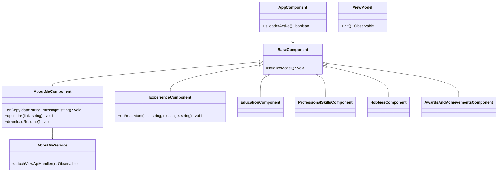
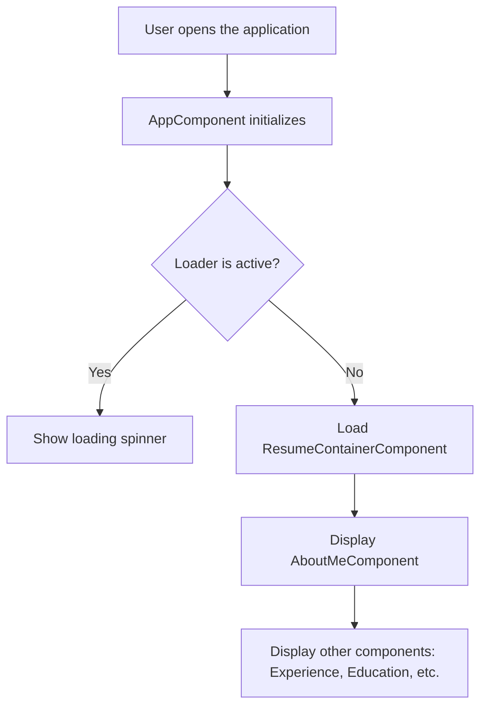
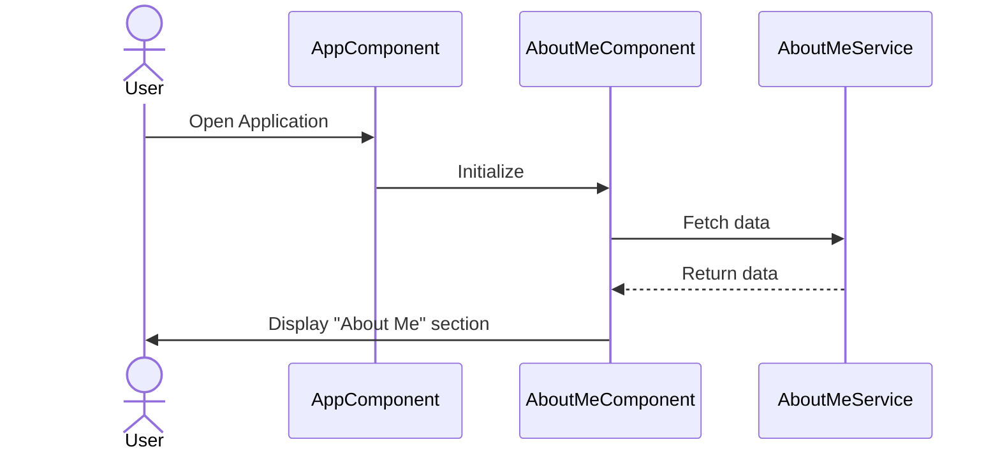

# Documentation Comment

# RaviResume3

## Project Description
This project is a resume builder application developed using Angular. It is designed to showcase personal and professional details in a structured and visually appealing format. The application follows modern web development practices and is built with modularity and scalability in mind.

## Folder Structure
```
Resume3.0/
├── src/
│   ├── app/
│   │   ├── resume/
│   │   │   ├── about-me/
│   │   │   ├── awards-and-achievements/
│   │   │   ├── education/
│   │   │   ├── experience/
│   │   │   ├── hobbies/
│   │   │   ├── professional-skills/
│   │   │   └── resume-container/
│   │   └── shared-module/
│   ├── assets/
│   └── environments/
├── angular.json
├── package.json
├── tsconfig.json
└── README.md
```

### Key Folders
- **app/**: Contains the main application logic, including components, modules, and routing.
- **resume/**: Houses feature-specific components like `about-me`, `education`, and `experience`.
- **shared-module/**: Contains shared utilities, services, and components used across the application.
- **assets/**: Stores static assets like images and icons.
- **environments/**: Configuration files for different environments (e.g., development and production).

## Class Diagram


## Flow Diagram


## Sequence Diagram


## How to Build the Project
1. Clone the repository:
   ```bash
   git clone <repository-url>
   cd Resume3.0
   ```
2. Install dependencies:
   ```bash
   npm install
   ```
3. Start the development server:
   ```bash
   npm start
   ```
   Navigate to `http://localhost:4200/` to view the application.
4. Build the project for production:
   ```bash
   ng build --prod
   ```

## Running Tests
- **Unit Tests**: Run `ng test` to execute unit tests via Karma.
- **End-to-End Tests**: Run `ng e2e` to execute end-to-end tests.

## Additional Notes
- Ensure that you have Node.js and Angular CLI installed on your system.
- Replace the placeholder diagrams with actual diagrams to provide a better understanding of the application architecture.

### Reference
- color palattes ---- https://colorhunt.co/palette/0000001f150c412d15e1dcc9