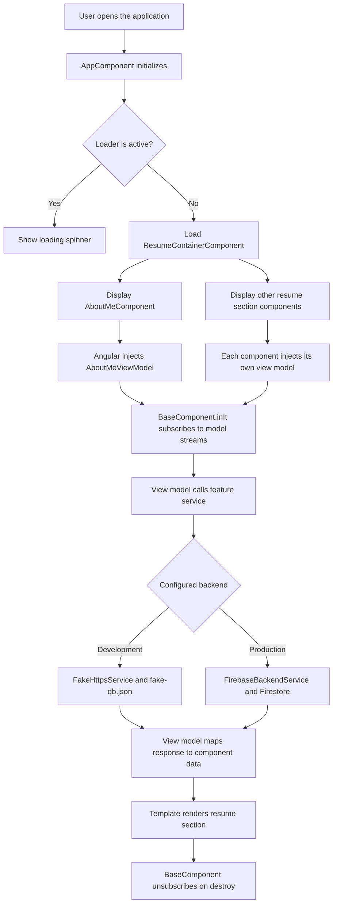
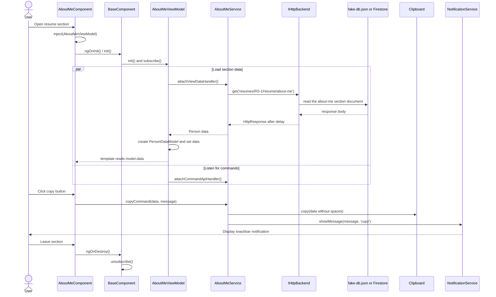

# RaviResume3

## Project Description
This project is a resume builder application developed using Angular. It is designed to showcase personal and professional details in a structured and visually appealing format. The application follows modern web development practices and is built with modularity and scalability in mind.

## Development and Security Checks

Install dependencies and run the production build with:

```bash
npm install
npm run build
```

Check dependencies for known vulnerabilities with:

```bash
npm audit
```

The `overrides` section in `package.json` pins vulnerable transitive dependencies to patched versions. The `body-parser` override is scoped to Karma so it does not change the major version required by Express. Hono is used by Angular's development tooling, and UUID is used by the Firebase Admin development/import chain; these overrides keep those development-only paths on patched releases. After dependency changes, verify both the audit and build before committing:

```bash
npm audit
npm run build
```

The expected result is zero reported vulnerabilities for both the complete
tree and production dependencies (`npm audit --omit=dev`).

Run the unit tests once in a headless browser with:

```bash
npm test -- --watch=false --browsers=ChromeHeadless
```

The test target uses `src/polyfills.ts` as an array entry because this project
uses Angular 22's application and Karma builders.

## Backend Architecture

The application separates feature logic from persistence details through the shared contract in `src/app/shared-module/interfaces/i-http-backend.ts`.

- `BaseService` consumes `IHttpBackend` instead of depending on a specific storage implementation.
- `FakeHttpsService` provides a local JSON-backed mock implementation for development and demos.
- `FirebaseBackendService` adapts Firestore document operations to the same Angular `HttpResponse` shape used elsewhere in the app.
- `FirebaseDatabaseService` initializes the Firebase app and exposes the shared `Firestore` and `Auth` instances.
- Environment flags allow the app to switch between the local mock backend and Firebase without changing the resume feature services.

### Resume data path

The application uses the following Firestore hierarchy so each user's resume data is isolated:

```text
resumes/{userId}/resume/{section}
```

For example:

```text
resumes/RS-1/resume/about-me
resumes/RS-1/resume/education
resumes/RS-1/resume/experience
```

The feature services request only a section name. `baseUrl` supplies the shared
`resumes/{userId}/resume` prefix, and `FirebaseBackendService` validates and
resolves the complete document path. Sections that are arrays are stored in
Firestore as `{ items: [...] }` because a Firestore document must be an object;
the adapter unwraps `items` before returning the response to the application.

The local data source mirrors the same hierarchy in
`src/app/shared-module/fake-db/fake-db.json`, so switching backends does not
change the payload shape consumed by the feature view models.

### Firebase import and rules

The local importer reads the fake database and writes each section document to
the hierarchy above. The importer is intentionally ignored by Git because it
is a local administrative utility; keep service-account JSON files outside the
repository and never commit them.

```bash
npm run import:resume -- "$HOME/Downloads/<service-account-file>.json"
```

When Firebase CLI configuration is added, deploy rules that allow public reads
for published resume content and restrict writes to an authenticated user whose
Firebase UID matches the `{userId}` path segment. Keep deployment rules in the
repository so the permission model is reviewable and repeatable.

Example environment state:

```ts
export const environment = {
    production: false,
    fakeBackend: true,
    firebaseBackend: false,
    baseUrl: 'resumes/RS-1/resume'
};
```

This keeps the resume modules stable while the data source remains replaceable and testable.

### View-model lifecycle

Resume components extend `BaseComponent<T>` and obtain their section view model
with Angular dependency injection in the component constructor. `ngOnInit`
calls `inIt()` once to subscribe to the view and command handlers; the base
class releases that subscription during `ngOnDestroy`.

View models use Angular's `inject()` API for their service dependencies and are
registered with `@Service()`. Do not instantiate these classes with `new` or
call the deprecated `ViewModelFactory`; tests should use `TestBed.inject(...)`
so they run inside an Angular injection context.

## Shared Presentation Components

### Timeline

The reusable timeline presentation component is located at:

`src/app/shared-module/components/timeline/`

It accepts a required `ITimeline[]` input through `timelineList`:

```html
<app-timeline [timelineList]="transformedTimelineItems"></app-timeline>
```

The consuming resume section is responsible for transforming its own domain
model into `ITimeline`. This keeps the timeline component presentational and
allows it to be reused by awards, education, experience, hobbies, and projects.
The shared contract is defined in:

`src/app/shared-module/interfaces/i-timeline.ts`

### Text magnifier

`TextMagnifierDirective` is a shared standalone directive located at:

`src/app/shared-module/directives/text-magnifier.directive.ts`

It is registered by `SharedModule` and applies to common text elements such as
headings, paragraphs, list items, links, labels, and table cells. Hovering or
focusing readable text displays one floating, magnified glass-style preview.
The directive manages the active tooltip globally so nested text elements and
adjacent list items do not display duplicate previews.

## Folder Structure
```
Resume3.0/
├── .github/workflows/             # Azure Static Web Apps workflow
├── .vscode/                       # Recommended IDE configuration
├── code-review/                   # Review notes and implementation plan
├── src/
│   ├── app/
│   │   ├── app.component.*        # Root component
│   │   ├── app.module.ts          # Root Angular module
│   │   ├── app-routing.module.ts  # Application routes
│   │   ├── resume/
│   │   │   ├── about-me/                  # Component, view model, and service
│   │   │   ├── awards-and-achievements/   # Component and view model
│   │   │   ├── contact/                   # Contact details component, model, service
│   │   │   ├── contact-me/                # Contact form component and view model
│   │   │   ├── education/                 # Component, view model, and service
│   │   │   ├── experience/                # Component, view model, and service
│   │   │   ├── experience-graph/          # Experience visualization component
│   │   │   ├── hobbies/                   # Component, view model, and service
│   │   │   ├── introduction/              # Component, view model, and service
│   │   │   ├── professional-skills/       # Component, view model, and service
│   │   │   ├── projects-experience/       # Component, view model, and service
│   │   │   ├── resume-container/          # Composes all resume sections
│   │   │   ├── social-media/              # Component and view model
│   │   │   ├── resume-routing.module.ts
│   │   │   └── resume.module.ts
│   │   └── shared-module/
│   │       ├── commands/                  # Copy and download commands
│   │       ├── components/                # Base, progress bar, and dialog components
│   │       ├── constants/                 # API endpoint constants
│   │       ├── enums/                     # Application contexts and command types
│   │       ├── factories/                 # View-model, HTTP, and error factories
│   │       ├── fake-db/                   # Local JSON data source
│   │       ├── functions/                 # Shared helper functions
│   │       ├── interfaces/                # Application contracts
│   │       ├── models/                    # Reusable data and view-model classes
│   │       ├── services/                  # HTTP, loader, notification, and base services
│   │       └── shared.module.ts
│   ├── assets/                    # Images, icons, and resume PDFs
│   ├── environments/              # Development and production settings
│   ├── custom-theme.scss
│   ├── main.ts
│   └── styles.css
├── angular.json                    # Angular CLI configuration
├── karma.conf.js                   # Karma test runner configuration
├── LICENSE                         # GNU GPL v3.0
├── package.json                    # Scripts and dependencies
├── SECURITY.md                     # Security policy
├── tsconfig*.json                  # TypeScript configurations
└── README.md
```

### Key Folders
- **app/**: Contains the main application logic, including components, modules, and routing.
- **resume/**: Houses the resume feature module and its section-specific components, view models, and services.
- **shared-module/**: Contains shared utilities, models, services, factories, and reusable UI components.
- **assets/**: Stores static assets like images and icons.
- **environments/**: Configuration files for different environments (e.g., development and production).

## Class Diagram

```mermaid
classDiagram
    class AppComponent {
        +isLoaderActive() boolean
    }

    class LoaderService {
        +isLoading boolean
        +show() void
        +hide() void
    }

    class ResumeContainerComponent

    class BaseComponent~T~ {
        +inIt() void
        +model IViewModel~T~
        +ngOnDestroy() void
    }

    class AboutMeComponent {
        +ngOnInit() void
        +onCopy(data, message) void
    }
    class ExperienceComponent {
        +ngOnInit() void
    }
    class ContactMeComponent {
        +form FormGroup
        +onSend() void
    }
    class IntroductionComponent
    class ProfessionalSkillsComponent
    class ProjectsExperienceComponent
    class AwardsAndAchievementsComponent
    class HobbiesComponent
    class EducationComponent
    class ContactComponent
    class SocialMediaComponent

    class ViewModelFactory {
        +getViewModelInstance(context, injector) ViewModel
    }
    class ViewModel~T~ {
        +data T
        +inIt() Observable~void~
        #attachViewHandler() Observable
        #attachCommandHandler() Observable
    }
    class AboutMeViewModel
    class ExperienceViewModel
    class EducationViewModel
    class ProfessionalSkillsViewModel
    class ProjectsExperienceViewModel
    class AwardsAndAchievemntsViewModel
    class HobbiesViewModel
    class IntroductionViewModel
    class SocialMediaModel
    class ContactViewModel
    class ContactMeViewModel

    class BaseService {
        +attachViewDataHandler~T~() Observable~T~
        +attachViewApiHandler~T~(url) Observable~T~
        +attachCommandApiHandler~T~() Observable~T~
        +copyCommand(data, message) void
        +downloadCommand(url, fileName) void
    }
    class AboutMeService
    class ExperienceService
    class FakeHttpsService {
        +get~T~(url) Observable~HttpResponse~T~~
    }
    class NotificationService {
        +showMessage(message, action) void
    }

    BaseComponent <|-- AboutMeComponent
    BaseComponent <|-- ExperienceComponent
    BaseComponent <|-- ContactMeComponent
    BaseComponent <|-- IntroductionComponent
    BaseComponent <|-- ProfessionalSkillsComponent
    BaseComponent <|-- ProjectsExperienceComponent
    BaseComponent <|-- AwardsAndAchievementsComponent
    BaseComponent <|-- HobbiesComponent
    BaseComponent <|-- EducationComponent
    BaseComponent <|-- ContactComponent
    BaseComponent <|-- SocialMediaComponent
    AppComponent --> LoaderService : reads state
    ResumeContainerComponent *-- AboutMeComponent : renders
    ResumeContainerComponent *-- ExperienceComponent : renders
    ResumeContainerComponent *-- ContactMeComponent : renders
    ResumeContainerComponent *-- IntroductionComponent : renders
    ResumeContainerComponent *-- ProfessionalSkillsComponent : renders
    ResumeContainerComponent *-- ProjectsExperienceComponent : renders
    ResumeContainerComponent *-- AwardsAndAchievementsComponent : renders
    ResumeContainerComponent *-- HobbiesComponent : renders
    ResumeContainerComponent *-- EducationComponent : renders
    ResumeContainerComponent *-- ContactComponent : renders
    ResumeContainerComponent *-- SocialMediaComponent : renders
    AboutMeComponent --> AboutMeViewModel : injects
    ExperienceComponent --> ExperienceViewModel : injects
    EducationComponent --> EducationViewModel : injects
    ProfessionalSkillsComponent --> ProfessionalSkillsViewModel : injects
    ProjectsExperienceComponent --> ProjectsExperienceViewModel : injects
    AwardsAndAchievementsComponent --> AwardsAndAchievemntsViewModel : injects
    HobbiesComponent --> HobbiesViewModel : injects
    IntroductionComponent --> IntroductionViewModel : injects
    SocialMediaComponent --> SocialMediaModel : injects
    ContactComponent --> ContactViewModel : injects
    ContactMeComponent --> ContactMeViewModel : injects
    ViewModel <|-- AboutMeViewModel
    ViewModel <|-- ExperienceViewModel
    ViewModel <|-- EducationViewModel
    ViewModel <|-- ProfessionalSkillsViewModel
    ViewModel <|-- ProjectsExperienceViewModel
    ViewModel <|-- AwardsAndAchievemntsViewModel
    ViewModel <|-- HobbiesViewModel
    ViewModel <|-- IntroductionViewModel
    ViewModel <|-- SocialMediaModel
    ViewModel <|-- ContactViewModel
    ViewModel <|-- ContactMeViewModel
    ViewModelFactory ..> ViewModel : deprecated compatibility adapter
    AboutMeViewModel --> AboutMeService
    ExperienceViewModel --> ExperienceService
    BaseService <|-- AboutMeService
    BaseService <|-- ExperienceService
    BaseService --> FakeHttpsService : retrieves view data
    BaseService --> NotificationService : handles commands
```


## Flow Diagram


## Sequence Diagram


## How to Build the Project
1. Clone the repository:
   ```bash
   git clone <repository-url>
   cd Resume3.0
   ```
2. Install dependencies:
   ```bash
   npm install
   ```
3. Start the development server:
   ```bash
   npm start
   ```
   Navigate to `http://localhost:4200/` to view the application.
4. Build the project for production:
   ```bash
    npm run build
   ```

## Running Tests
- **Unit Tests**: Run `npm test` to execute unit tests via Karma.
- The repository does not currently define an end-to-end test script.

## Additional Notes
- Ensure that you have Node.js and Angular CLI installed on your system.
- The diagrams describe the current view-model and backend flow; update them when the provider or data-path contract changes.

### Reference
- color palattes ---- https://colorhunt.co/palette/0000001f150c412d15e1dcc9
